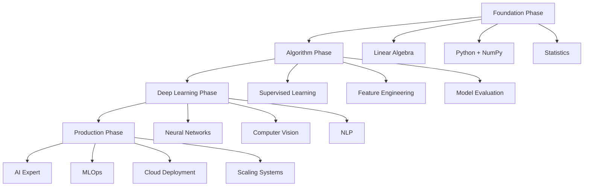

<div align="center">

# Ali Badran


</div>

---

<div align="center">

## About Me

</div>

```python
class AIEngineer:
    def __init__(self):
        self.name = "Ali Badran"
        self.location = "Cairo, Egypt 🇪🇬"
        self.education = "University of London"
        self.current_focus = ["Linear Algebra", "Python", "Machine Learning"]
        self.goal = "Transform ideas into intelligent solutions"
        
    def get_current_status(self):
        return {
            " Learning": "3Blue1Brown Linear Algebra Series",
            " Reading": "Python Crash Course",
            " Target": "First Kaggle Competition",
            " Building": "AI Foundation Projects"
        }
        
    def future_plans(self):
        return ["Kaggle Expert", "AI Consultant", "Problem Solver"]

me = AIEngineer()
print("Building the future, one algorithm at a time...")
```

---

<div align="center">

## Learning Journey


</div>

### Current Phase: **Foundation Building**

<div align="center">

| **Linear Algebra** | **Python Mastery** | **Statistics** | **Kaggle Prep** |
|:---:|:---:|:---:|:---:|
|  |  |  |  |

</div>

### The Roadmap Ahead



---

<div align="center">

##  Tech Arsenal


### Currently Mastering


### Next in Pipeline


</div>

---

<div align="center">

##  GitHub Analytics


</div>

---

<div align="center">

##  Let's Connect & Build Together

<a href="https://www.linkedin.com/in/ali-badran-447271357/">

</a>
<a href="mailto:your.email@example.com">

</a>

###  Open to:
-  **Data Analysis Projects** - Let's solve real business problems
-  **Kaggle Collaborations** - Team up for competitions  
-  **Study Groups** - Learn together, grow faster
-  **AI Discussions** - Share ideas and insights


</div>

---

<div align="center">

###  Philosophy

*"In the world of AI, we're not just writing code—we're crafting the future, one algorithm at a time."*


</div>
